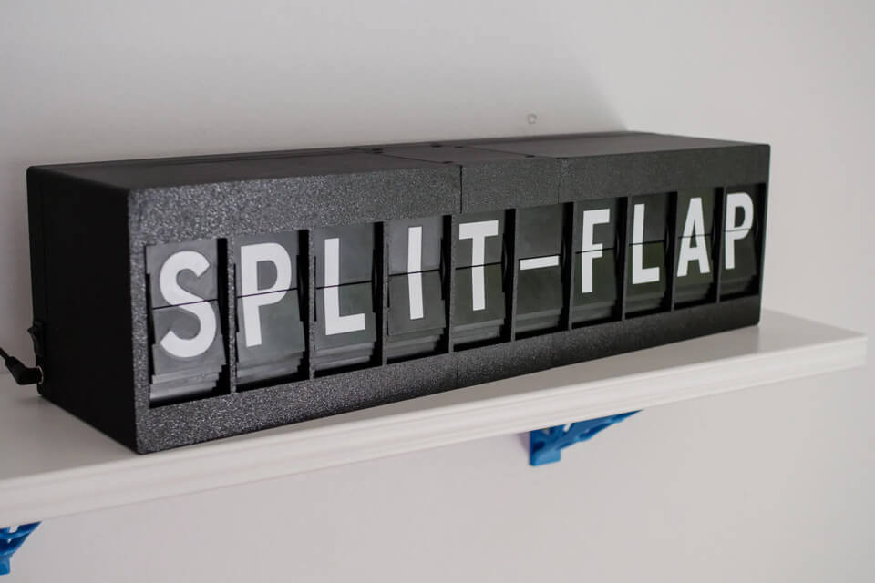
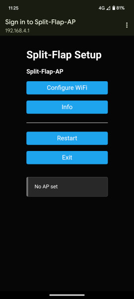

# Split-Flap
[](https://github.com/JonnyBooker/split-flap/actions/workflows/build-esp-master.yml) [](https://github.com/JonnyBooker/split-flap/actions/workflows/build-eeprom-write.yml) [](https://github.com/JonnyBooker/split-flap/actions/workflows/build-unit.yml)



This project has been forked from the brilliant [Split Flap Project](https://github.com/Dave19171/split-flap) by [David Königsmann](https://github.com/Dave19171). None of this would have been possible without the great foundations that have been put in place.

This project has built on the original project to add extra features such as:
- Message Splittng
  - If a message is longer then the number of units there are, the message will be split up and displayed in sequence with a delay between each message
  - Also messages can be split up by adding a `\n`
- Countdown Mode
  - Countdown in days to a specified date
- Added ability to setup WiFi connection on device
  - The device will set itself up as a Access Point (AP) on first start. You will be able to connect to this network and a web portal will be provided where you can setup the WiFi network you want to connect to
  - If the device was to lose connection, it should retry and if all else fails, it will open up the web portal again to change the WiFi settings if necessary
- Reworked UI
  - Can see messages scheduled to be displayed and option to remove them
  - Loading indicators
  - Show hide information to fill out for the mode you select
  - See extra information on the UI such as:
    - Last Message Received
    - Number of Flaps registered
    - Version Number running
    - How many characters/lines are in the textbox for text
    - Add newline button (as typing `\n` is a pain on a mobile keyboard)
- Message Scheduling
  - Ability to send a message and display it at a later date. If the clock was in another mode such as `Clock` mode, it will show the message for a duration, then return to that mode
- Arduino OTA
  - Over the Air updates to the display
- Updated `README.md` to add scenarios of problems encountered

Also the code has been refactored to try facilitate easier development:
- Changed serial prints to one central location so don't have to declare serial enable checks when a new one is required
- Renamed files and functions
- Ping endpoint
- Updated `data` so can test out project locally without having to call a webserver via a `localDevelopment` flag

3D-files here on [Printables](https://www.prusaprinters.org/prints/69464-split-flap-display)!

## General
The display's electronics use 1 x ESP01 (ESP8266) as the main hub and up to 16 Arduinos as receivers. The ESP handles the web interface and communicates to the units via I2C. Each unit is resposible for setting the zero position of the drum on startup and displaying any letter the main hub send its way.

Assemble everything according to the instruction manual which you can find on [GitHub](./Instructions/SplitFlapInstructions.pdf).

### PCB
Gerber files are in the `PCB` folder. These are the scehematics for the PCB boards and say, what is needed and where. You need one per unit. Populate components according to the [instruction manual](./Instructions/SplitFlapInstructions.pdf). 

Options to potentially get boards created for you:
- [PCB Way](https://www.pcbway.com/)
- [JLC PCB](https://jlcpcb.com/)

> Note: Services are offered by these companies to assembly the boards for you. There are surface mounted components to these devices that you might not be able to do yourself like small resistors for instance, which must be flow soldered. It could be worth having the company do this aspect for you.

### Unit
Each split-flap unit consists of an Arduino Nano mounted on a custom PCB. It controls a 28BYJ-48 stepper motor via a ULN2003 driver chip. The drum with the flaps is homed with a KY003 hall sensor and a magnet mounted to the drum.

Upload the Arduino sketch `Unit.ino` in the unit folder to each unit's arduino nano. Before that set the offset with the `EEPROM_Write_Offset.ino` sketch. 

Inside `Unit.ino`, there is a setting for testing the units so that a few letters are cycled through to ensure what is shown is what you expect. At the top of the file once you have opened the project, you will find a line that is commented out:
```c++
#define SERIAL_ENABLE   // uncomment for serial debug communication
#define TEST_ENABLE    	// uncomment for test mode where the unit will cycle a series of test letters. 
```

> Note: If you experience any problems uploading the unit sketch, you may have to change your `Processor` to use the old bootloader, called `ATmega328p (Old Bootloader)`.

Remove the comment characters to help with your testing for the next step of Setting the Zero Position Offset.

#### Set Zero Position Offset
The zero position (or blank flaps position in this case) is attained by driving the stepper to the hall sensor and step a few steps forward. This offset is individual to every unit and needs to be saved to the arduino nano's EEPROM.

A simple sketch has been written to set the offset. Upload the `EEPROM_Write_Offset.ino` sketch and open the serial monitor with 115200 baudrate. It will tell you the current offset and you can enter a new offset. It should be around 100 but yours may vary. You may need to upload the `Unit.ino` sketch with the `TEST_ENABLE` flag uncommented and see if the offset is correct. Repeat until the blank flap is showing every time the unit homes.

#### Set Unit Address
Every units address is set by a DIP switch. They need to be set ascending from zero in binary.
This is how my 10 units are set, 1 means switch is in the up-position:
| Unit 1  | Unit 2 | Unit 3 | Unit 4 | Unit 5 | Unit 6 | Unit 7 | Unit 8 | Unit 9 | Unit 10 |
| --- | --- | --- | --- | --- | --- | --- | --- | --- | --- |
| 0000 | 0001 | 0010 | 0011 | 0100 | 0101 | 0110 | 0111 | 1000 | 1001 |

### ESP01/ESP8266
#### Pre-requistites
To upload the sketch to the ESP you need to install a few things to your arduino IDE.
- Install the ESP8266 board to your Arduino IDE. You can follow [this tutorial](https://randomnerdtutorials.com/how-to-install-esp8266-board-arduino-ide/) 
- Install the arduino ESP8266 littleFS plugin to use the file system of the ESP, you can follow [this tutorial](https://randomnerdtutorials.com/install-esp8266-nodemcu-littlefs-arduino/) 
- Install the following libraries via Library Manager:
  - [Arduino_JSON](https://github.com/arduino-libraries/Arduino_JSON)
  - [NTPClient](https://github.com/arduino-libraries/NTPClient)
  - [ezTime](https://github.com/ropg/ezTime)
  - [LinkedList](https://github.com/ivanseidel/LinkedList)
  - [WiFiManager](https://github.com/tzapu/WiFiManager)
- Install the following libraries via including the included `.zip` folders in the `ArduinoLibraries` in this repository in your Arduino Libraries IDE libaries folder:
	- ESPAsyncWebServer
    	- Downloaded From: https://github.com/me-no-dev/ESPAsyncWebServer/archive/master.zip
    	- This library was modified to add a namespace to the `LinkedList` used within its internals to avoid conflicts with `LinkedList` library
	- ESPAsyncTCP 
    	- Downloaded From: https://github.com/me-no-dev/ESPAsyncTCP/archive/master.zip

To upload sketches to the ESP8266 you can either use an [Arduino Uno](https://create.arduino.cc/projecthub/pratikdesai/how-to-program-esp8266-esp-01-module-with-arduino-uno-598166) or you can buy a dedicated programmer. It is highly recommend getting a programmer as it makes uploading programs onto the ESP8266 much faster. 

> Note: Be wary of ESP8266 programmers that are available which allow USB connection to your PC which may not have programming abilities. Typically extra switches are available so that the ESP8266 can be put in programming mode, although you can modify the programmer through a simple solder job to allow it to enter programming mode. Examples can be found in the customer reviews of [Amazon](https://www.amazon.co.uk/gp/product/B078J7LDLY/ref=ppx_yo_dt_b_search_asin_title?ie=UTF8&th=1). 

> Alternatively, you can get a dedicated programmer from Amazon such as [this one](https://www.amazon.co.uk/dp/B083QHJW21). This is also available on [AliExpress](https://www.aliexpress.com/item/1005001793822720.html?spm=a2g0o.detail.0.0.48622aefV0Zv89&mp=1) if you are willing to wait a while for it.

#### Uploading the Static Assets via LittleFS
There are static files located [here](./ESPMaster/data/) in the `data` folder of ESPMaster which will need to be uploaded. These make up the website that will be accessible on your WiFi so you can update the Split-Flap display.

Open the sketch `ESPMaster.ino` in the `ESPMaster` folder, change your board to "Generic ESP8266 Module", choose the correct COM-port and click:

> Tools -> ESP8266 LittleFS Data Upload

This uploads the website onto the ESP8266's file system.

**NOTE:** No sketch has been uploaded yet! Only the static files. At the time of writing, this will also only work on an older version of Arduino IDE < version 2. The latest Arduino IDE broke support for Plugins such as the LittleFS plugin.

#### Updating Settings of the Sketch
There are several options in the Sketch you can modify to customise or change the behaviour of the display. These are marked in the code as "Configurable". 

By default, the system will run in an "Access Point" mode where you will be able to connect to the display and put in WiFi credentials directly. This means if you WiFi changes, you don't have to re-upload a new sketch. Screenshot of the WiFi setup portal:


Alternatively, you can specify credentials directly. You can go ahead and change the credentials in these variables:
```c++
const char* wifiDirectSsid = "";
const char* wifiDirectPassword = "";
```

You will also need to change the WiFi Mode in the code via changing this variable to "DIRECT":
```c++
//Option to either direct connect to a WiFi Network or setup a AP to configure WiFi. Options: AP or DIRECT
#define WIFI_SETUP_MODE DIRECT      
```

You will also want to change the `timezoneString` to your time zone. You can find the TZ database names here: https://en.wikipedia.org/wiki/List_of_tz_database_time_zones

You can also modify the date and clock format easily by using this table: https://github.com/ropg/ezTime#datetime

There are several helper `define` variables to help during debugging/running:
- **SERIAL_ENABLE**
  - Use this to enable Serial output lines for tracking executing code
- **OTA_ENABLE**
  - Use this to enable OTA updates from the Arduino IDE
  - Subsequently, you can set a password for OTA via the `otaPassword` variable
- **UNIT_CALLS_DISABLE**
  - Use this to disable the communication with the Arduino Nano Units. This will mean you can check code over function for the ESP module.

#### Sketch Upload
So far we've only uploaded static files to the ESP8266. You now need to `Upload` the sketch to the ESP8266. Click on Upload and the ESP8266 will be upadted with the sketch and you are done. Stick the ESP8266 onto the first unit's PCB and navigate to the IP-address the ESP8266 is getting assigned from your router.

### Common Mistakes
- If the ESP is not talking to the units correctly, check the `UNITSAMOUNT` in the `ESPMaster.ino`. The amount of units connected has to match.
- Ensure you upload the sketch and the LittleFS sketch upload to the ESP8266. 
- When the system is powered, your Hall Sensor should only light up when a magnet is nearby. 
- Ensure you are running an older version of Arduino IDE to be able to upload static files to the device. You will need a version prior to version 2.x.